# BÁO CÁO BÀI TẬP ÔN TẬP WINDOWS FORMS (BÀI 1 - BÀI 5)

## THÔNG TIN SINH VIÊN
- **Họ và tên:** Nguyễn Anh Xuân
- **Mã số sinh viên:** 24810320189
- **Lớp:** D19QTANM1
- **Tên môn học:** Lập trình .Net / Windows Forms
- **Tên bài tập:** Ôn tập Windows Forms (Bài 1 đến Bài 5)

---

### Bài 1: Máy tính tính cước dịch vụ & Giảm giá (Service Charge Calculator)
- **Mục tiêu:** Form, TextBox, Button, validate kiểu số, tính toán số tiền có chiết khấu.
- **File code:** [`Bai1/Form1.cs`](./Bai1/Form1.cs)
- **Công thức:** `Tổng tiền = (Đơn giá × Số lượng) × (100 - % Giảm) / 100`
- **Ảnh thực thi & kiểm tra:**
  - 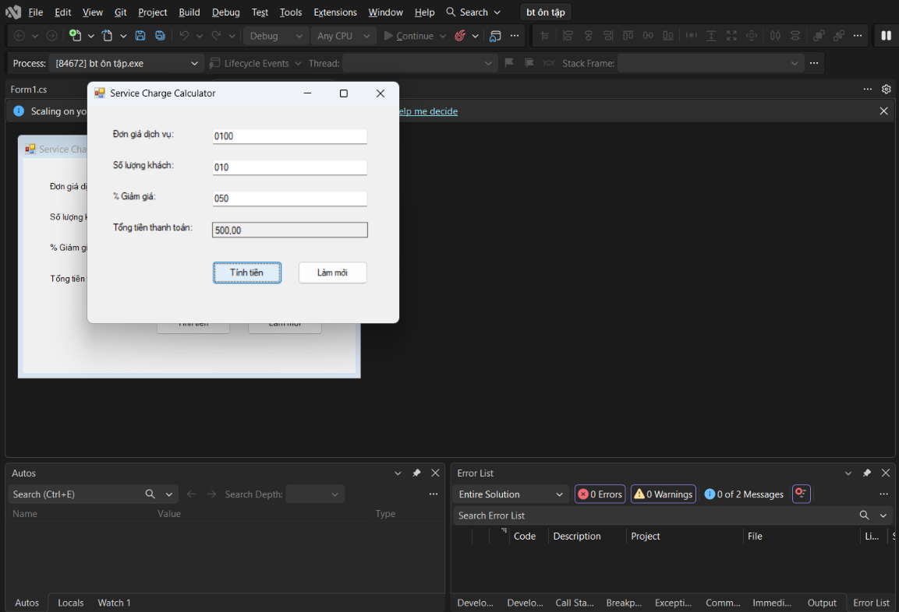
  - 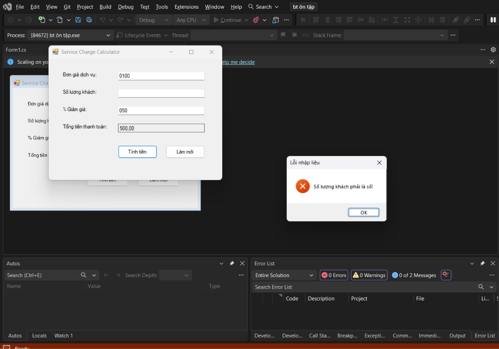

---

### Bài 2: Form Tiếp nhận & Phân loại sự cố IT (IT Support Ticket Form)
- **Mục tiêu:** RadioButton, CheckBox, ComboBox, DateTimePicker, PictureBox kèm OpenFileDialog.
- **File code:** [`Bai2/Form1.cs`](./Bai2/Form1.cs)
- **Chức năng:** Tải ảnh lỗi, gom dữ liệu hiển thị thông báo tóm tắt qua MessageBox.
- **Ảnh thực thi & kiểm tra:**
  - 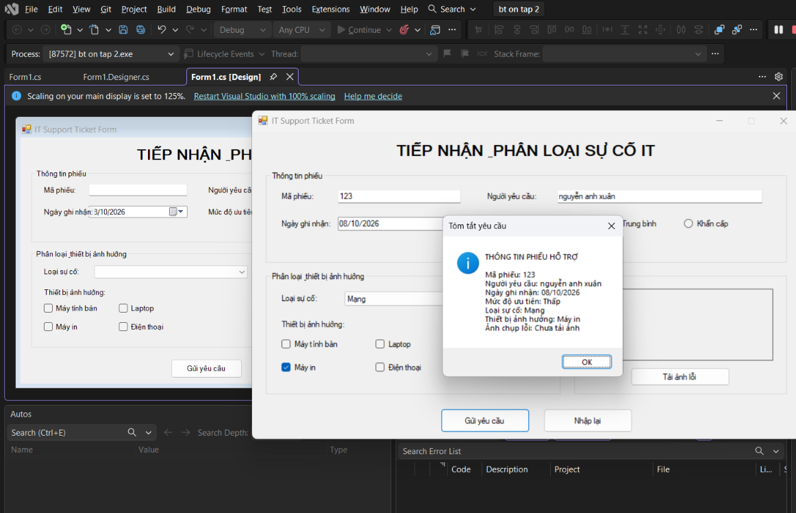

---

### Bài 3: Quản lý danh mục Vật tư / Linh kiện (Item List Manager)
- **Mục tiêu:** ListView (Details mode), Thêm / Cập nhật / Xóa dòng / Xóa tất cả, kiểm tra trùng mã vật tư.
- **File code:** [`Bai3/Form1.cs`](./Bai3/Form1.cs)
- **Ảnh thực thi & kiểm tra:**
  - 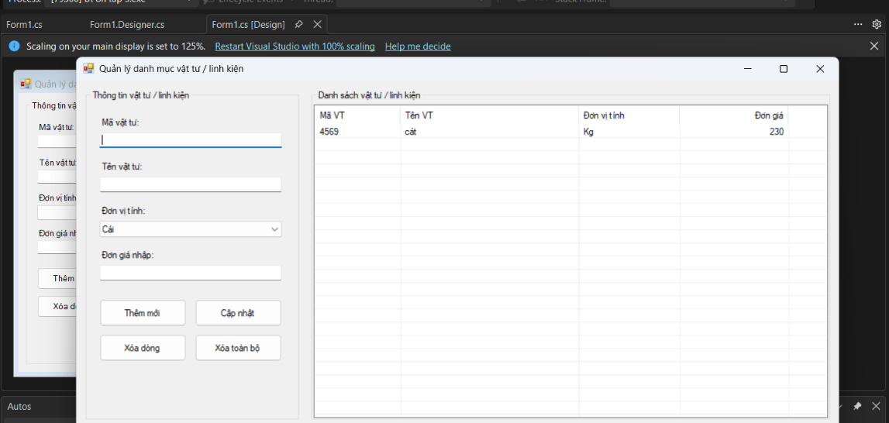
  - 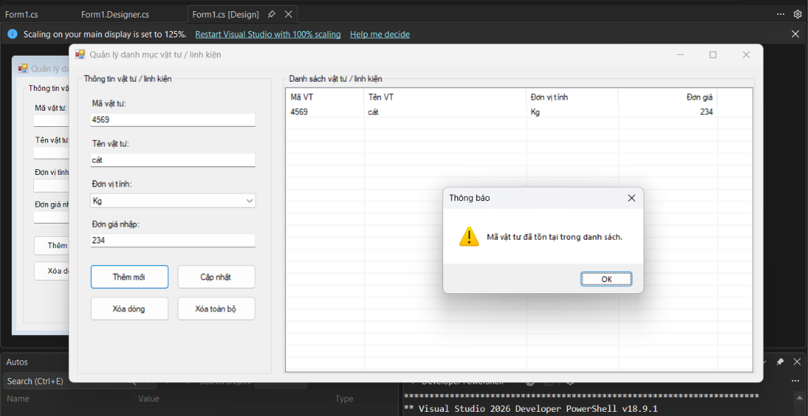
  - 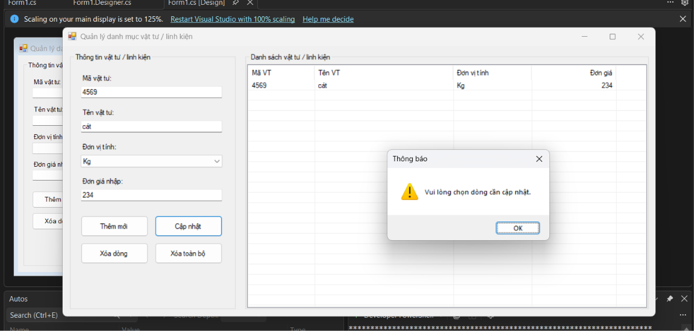
  - 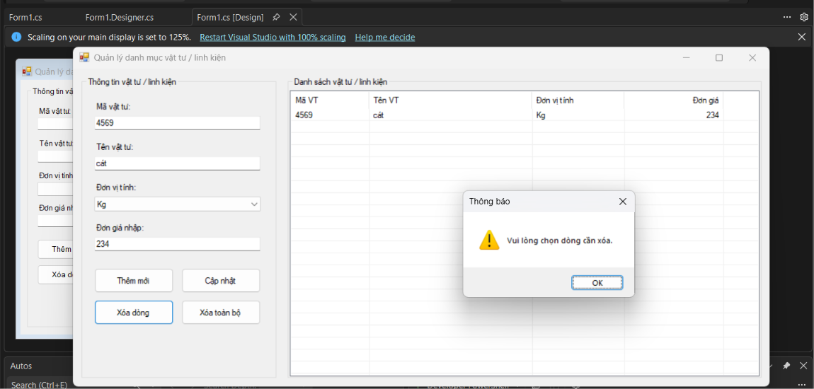

---

### Bài 4: Sơ đồ chọn vị trí chỗ ngồi / Đặt bàn hẹn giờ (Interactive Slot Booking)
- **Mục tiêu:** Xử lý sự kiện dùng chung cho 20 nút vị trí (Event Aggregation), quản lý 3 trạng thái màu (Trắng: Trống, Xanh: Đang chọn, Đỏ: Đã đặt / Khóa).
- **File code:** [`Bai4/Form1.cs`](./Bai4/Form1.cs)
- **Ảnh thực thi & kiểm tra:**
  - 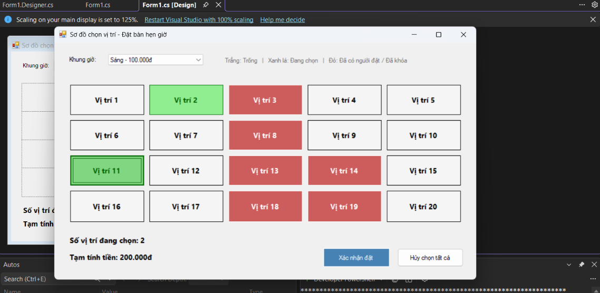
  - 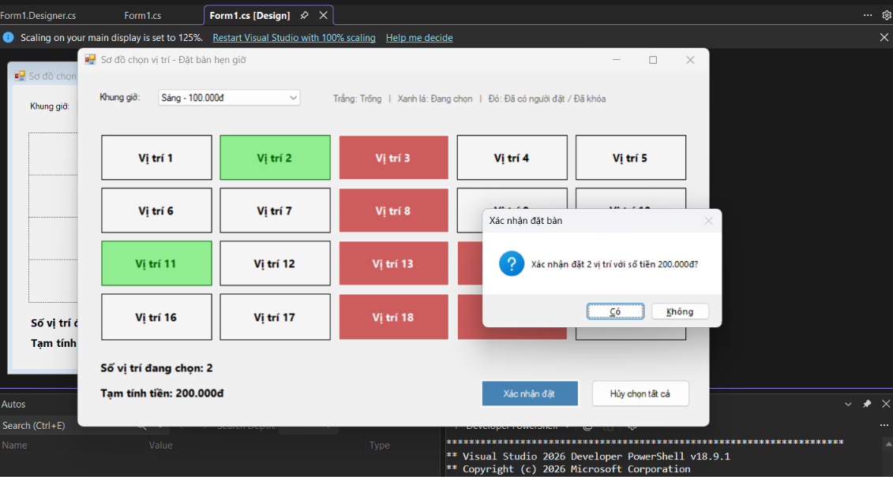
  - 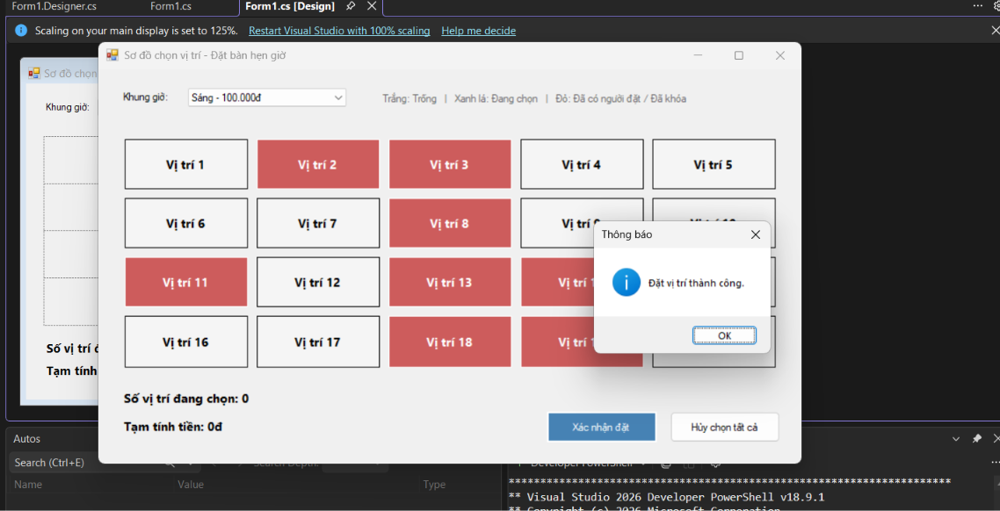
  - 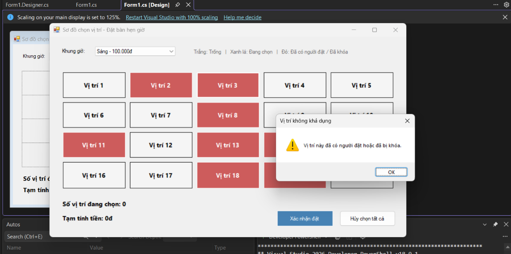

---

### Bài 5: Bảng điều khiển Quản lý Đơn giao hàng (Delivery Order Dashboard)
- **Mục tiêu:** SplitContainer, DataGridView (tự động tính Thành tiền, validate `ErrorProvider`), Timer cập nhật đồng hồ hệ thống, StatusStrip thống kê, phím tắt `F2` và `Delete`.
- **File code:** [`Bai5/Form1.cs`](./Bai5/Form1.cs)
- **Ảnh thực thi & kiểm tra:**
  - 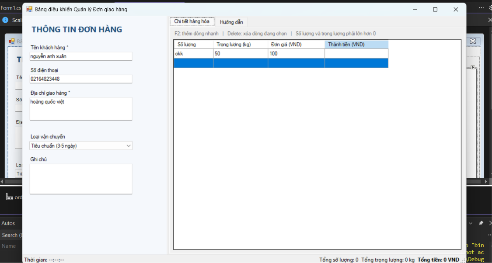
